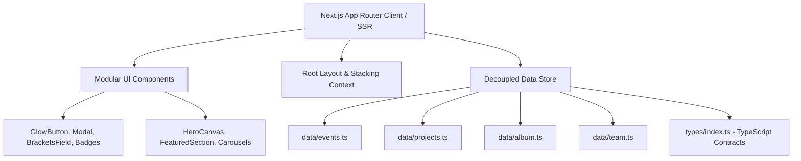

# GDG on Campus RMKEC — Project Progress Report

**Document Date:** September 20, 2026  
**Repository:** `gdg-rmkec`  
**Current Branch:** `new-gdg`  
**Framework Version:** Next.js 16.2.11 (Turbopack) & React 19  

---

## 1. Executive Summary

The **Google Developer Group on Campus — RMK Engineering College (GDG on Campus RMKEC)** platform serves as the central digital hub for student developers, tech enthusiasts, and community builders. It showcases flagship hackathons, technical workshops, study jams, open-source student innovations, and community event memories.

This document details the project's current development status, recent architectural refactorings, layout enhancements, button hierarchy streamlining, and verification results.

---

## 2. Technical Stack & Architecture



- **Frontend Core:** Next.js 16.2.11 with Turbopack bundler and React 19.
- **Styling & Design System:** Tailwind CSS with Google Developer palette (`#4285F4` Blue, `#EA4335` Red, `#FBBC05` Yellow, `#34A853` Green) on a dark aesthetic canvas.
- **Animation & Motion:** Framer Motion for smooth modal transitions, interactive carousels, and hover micro-interactions.
- **Iconography:** Lucide React icons.
- **Type Safety:** Centralized TypeScript definitions in `types/index.ts`.

---

## 3. Page Inventory & Implemented Features

| Route | Page Name | Status | Key Features & Implementation |
| :--- | :--- | :--- | :--- |
| `/` | **Home** | Completed | HeroCanvas 3D particles, quick stats bar, domain pathways, DevFest vibes carousel, venue map, call-to-actions linking to `/technical-wings`. |
| `/events` | **Events & Study Jams** | Completed | Tabbed filtering (Upcoming, Past, Workshops, Hackathons), search bar, detailed event popover with speaker lineups and registration links. |
| `/projects` | **Campus Innovation Labs** | Completed | Domain filtering (AI/ML, Campus Solutions, Web, Cloud), project cards, technical stack badges, full architectural modal inspection, direct links to Technical Wings. |
| `/album` | **Event Archives & Albums** | Completed | 4 Flagship Albums (Cloud Campaign, HackNEXA'26, Agentic AI, A.C.E Day), side-by-side slideshow modal, fullscreen lightbox. |
| `/community` | **Community Portal** | Completed | Community overview, values, track leads, and engagement statistics. |
| `/family` | **Team / Family** | Completed | Leadership spotlight, domain coordinators, core team rosters, and social connect links. |
| `/journey` | **Milestones & Journey** | Completed | Interactive timeline of chapter achievements and national campaigns. |
| `/memories` | **Memories Archive** | Completed | Interactive carousel gallery preserving community gatherings. |
| `/technical-wings` | **Technical Wings Registration** | Completed | Dedicated candidate intake portal with non-scrolling interactive wing selection (5 official wings), tech stack badges, GitHub verification, structured registration form, and backend webhook forwarding. |
| `/join` | **Core Team Recruitment** | Completed | Focused Core Team recruitment portal with dedicated "Join in Technical Wing →" button beside "Apply for Membership" and single submit button. |
| `/tickets` | **Event Passes & Tickets** | Completed | Digital pass generator / event ticketing interface. |
| `/contact` | **Contact & Inquiries** | Completed | "Send Us a Message" inquiry portal with direct first-party Gmail SMTP delivery (`nodemailer`) to inbox with validated backend endpoint `/api/contact`. |

---

## 4. Recent Major Upgrades & Bug Fixes

### 4.1. Header & Footer Modal Overlap Bug Fix
- **Root Cause Analysis:**  
  Previously, `<main className="flex-grow relative z-10">` in `app/layout.tsx` created an isolated stacking context. Because `position: relative` paired with an integer `z-index` forms a new stacking context, any modals or backdrops inside `{children}` were trapped beneath `<Navbar className="fixed z-50">` and overlapping `<Footer className="relative z-10">`.
- **Solution Implemented:**
  1. **Stacking Context Unlocked:** Removed `relative z-10` from `<main>` in [`app/layout.tsx`](file:///C:/Users/Cursory_Inverse/Desktop/gdg-rmkec/app/layout.tsx). Modals can now rise freely to top-level viewports.
  2. **Footer Layering Rebalanced:** Set footer to `relative z-0` in [`components/layout/Footer.tsx`](file:///C:/Users/Cursory_Inverse/Desktop/gdg-rmkec/components/layout/Footer.tsx).
  3. **High Elevation Z-Indices:** Elevated modal backdrops and containers to `z-[100]` and `z-[110]` across [`app/events/page.tsx`](file:///C:/Users/Cursory_Inverse/Desktop/gdg-rmkec/app/events/page.tsx), [`app/projects/page.tsx`](file:///C:/Users/Cursory_Inverse/Desktop/gdg-rmkec/app/projects/page.tsx), and [`app/album/page.tsx`](file:///C:/Users/Cursory_Inverse/Desktop/gdg-rmkec/app/album/page.tsx).
  4. **Body Scroll Lock:** Added `document.body.style.overflow = 'hidden'` locks and `Escape` key event listeners so page scrolling is frozen behind active dialogs.

---

### 4.2. Album Modal Side-by-Side UX Overhaul
- **Problem Statement:**  
  When an event album was opened, the photo thumbnails were positioned below the large photo preview. Users had to repeatedly scroll down past the preview image to view and select different photos.
- **Solution Implemented:**
  - Expanded modal dialog width to `max-w-6xl xl:max-w-7xl` to comfortably accommodate a split layout.
  - Implemented a two-column responsive grid (`grid grid-cols-1 lg:grid-cols-12 gap-5`):
    - **Left Column (`lg:col-span-7 xl:col-span-8`):** High-resolution photo preview with prev/next navigation controls, fullscreen expand button, and photo metadata card (title, caption, venue, attendees, tags).
    - **Right Column (`lg:col-span-5 xl:col-span-4`):** Dedicated "All Album Photos" panel with a scrollable 2-column thumbnail grid (`overflow-y-auto max-h-[64vh]`).
  - Clicking any thumbnail updates the active preview on the left instantly with zero vertical page shifting.

---

### 4.3. Code Cleanliness & Architecture Refactoring
- **Separation of Concerns:**
  - `app/album/page.tsx` previously contained over 1,000 lines of hardcoded photo data and album schemas directly inside the React component file, making it 1,702 lines long and difficult to maintain.
  - **Extracted Data Fixtures:** Created [`data/album.ts`](file:///C:/Users/Cursory_Inverse/Desktop/gdg-rmkec/data/album.ts) containing `eventAlbums` and `albumPhotos`, mirroring the architecture of `data/events.ts` and `data/projects.ts`.
  - **Centralized Types:** Added `EventCategory`, `AlbumPhoto`, and `EventAlbum` interfaces to [`types/index.ts`](file:///C:/Users/Cursory_Inverse/Desktop/gdg-rmkec/types/index.ts).
  - **Component Size Reduced:** `app/album/page.tsx` was reduced by over **60%** (from 1,702 lines to 683 lines), resulting in clean, readable, and maintainable code.

---

### 4.4. Dedicated Technical Wings Registration Portal (`/technical-wings`)
- **New Dedicated Registration Experience:**
  - Built a standalone, production-grade registration portal at [`/technical-wings`](file:///C:/Users/Cursory_Inverse/Desktop/gdg-rmkec/app/technical-wings/page.tsx).
  - **Modern Side-by-Side Layout:** Left column houses the 5 official Technical Wings in an interactive non-scrolling selector; right column houses the structured engineering intake form with paired inputs without dead space underneath.
  - **The 5 Official Technical Wings:**
    1. **AI + Electronics Integration:** Hardware prototyping, embedded AI, sensor networks, and IoT interfacing (ESP32 / Arduino / Raspberry Pi).
    2. **AI / ML:** Generative AI, LLMs, computer vision, and RAG pipelines with Google Gemini APIs.
    3. **Backend Development:** High-scale microservices, distributed databases, and containerized clusters on Google Cloud (GKE).
    4. **Cybersecurity:** Defensive security audits, vulnerability triage, CTFs, and Linux infrastructure hardening.
    5. **UI/UX Design:** Material 3 & motion-driven digital product design, tokenized design systems, and Figma prototypes.
  - **Non-Scrolling 1-Click Interactive Selector:**
    - Completely removed inner scroll containers (`overflow-y-auto` and `max-h-[...]`).
    - All 5 wings are immediately visible on screen. The selected wing smoothly expands to show its full descriptive paragraph, key technology badges, and live campus deployment samples.
    - Clicking any wing selects it, expands its dossier, and synchronizes with the registration form dropdown.
  - **Eliminated Dead Space Below Form:**
    - Balanced left selector height (~520px) and right form height (~680px), completely removing the previous 800px void.
    - Trimmed page padding and margins for a tight, professional presentation.
  - **Full-Width Intake Roadmap Banner:**
    - Positioned directly below the dual columns:
      - **Stage 01:** Online Application (particulars & tech stack).
      - **Stage 02:** Technical Review (friendly domain task or interaction).
      - **Stage 03:** Squad Onboarding (candidates will be invited to the WhatsApp group and will receive their offer letter).
  - **Backend & Google Sheet Integration:**
    - [`/api/apply`](file:///C:/Users/Cursory_Inverse/Desktop/gdg-rmkec/app/api/apply/route.ts) sanitizes all candidate inputs and forwards payloads in real time to the chapter's live Google Sheet via Google Apps Script Webhook (`GOOGLE_SHEET_WEBHOOK_URL`).
    - Submissions are automatically routed into dedicated tabs: **`Core Team`** (from `/join`) and **`Technical Wings`** (from `/technical-wings`).
  - **Connected Call-to-Actions:**
    - Connected homepage sections ([`SeeYouThereSection.tsx`](file:///C:/Users/Cursory_Inverse/Desktop/gdg-rmkec/components/sections/SeeYouThereSection.tsx), [`DevFestVibesSection.tsx`](file:///C:/Users/Cursory_Inverse/Desktop/gdg-rmkec/components/sections/DevFestVibesSection.tsx)) and [`app/projects/page.tsx`](file:///C:/Users/Cursory_Inverse/Desktop/gdg-rmkec/app/projects/page.tsx) directly to `/technical-wings`.

---

### 4.5. Join Us Page (`/join`) Streamlining & Button Hierarchy
- **Problem Statement:**  
  Previously, action buttons were scattered redundantly across the hero, the form header, below the form, and on post-submission screens, causing visual distraction.
- **Solution Implemented:**
  1. **Beside "Apply for Membership":** Retained the dedicated [**Join in Technical Wing →**](file:///C:/Users/Cursory_Inverse/Desktop/gdg-rmkec/app/join/page.tsx#L312-L325) button in the form card header to direct technical applicants to the appropriate intake pipeline.
  2. **Below the Form:** Made [**Submit Application →**](file:///C:/Users/Cursory_Inverse/Desktop/gdg-rmkec/app/join/page.tsx#L478-L490) the **single** action button beneath the form.
  3. **Removed Clutter:** Removed extra action buttons from the left hero section and the post-submission screen.
  4. **Core Team Focus:** Subtitle preserved as *"Fill in your details to join the Core team."*, with Opportunity preferences dedicated to chapter leadership roles (Lead, Event Management, Design, PR, HR, Outreach).
  5. **Header Tag Cleanup:** Removed the "AY 2025–2026" badge from both [`/join`](file:///C:/Users/Cursory_Inverse/Desktop/gdg-rmkec/app/join/page.tsx) and [`/technical-wings`](file:///C:/Users/Cursory_Inverse/Desktop/gdg-rmkec/app/technical-wings/page.tsx) for a cleaner, modern presentation.

---

### 4.6. Live Google Sheets Webhook Integration (Dual-Tab Automated Pipeline)
- **Architecture & Workflow:**
  - Configured [`app/api/apply/route.ts`](file:///C:/Users/Cursory_Inverse/Desktop/gdg-rmkec/app/api/apply/route.ts) with real-time forwarding to the user's deployed Google Apps Script Web App.
  - Set the secure webhook URL in [`.env.local`](file:///C:/Users/Cursory_Inverse/Desktop/gdg-rmkec/.env.local) under `GOOGLE_SHEET_WEBHOOK_URL` (safely excluded from git tracking via [`.gitignore`](file:///C:/Users/Cursory_Inverse/Desktop/gdg-rmkec/.gitignore#L34)).
- **Intelligent Dual-Tab Routing:**
  - **Core Team Submissions (`/join`):** Automatically recorded into the **`Core Team`** sheet tab with full name, roll number, email, phone, department, year, target core role, and motivation.
  - **Technical Wings Submissions (`/technical-wings`):** Automatically recorded into the **`Technical Wings`** sheet tab with primary wing, alternative wing, known technologies, GitHub URL, portfolio, relevant experience, and weekly commitment.
- **Verification & Testing:**
  - Live payload tests dispatched to the endpoint; received `HTTP 200` with `{"result": "success"}` on both pipelines.
  - Automatic header row creation with styled Google Blue branding (`#4285F4`).

---

### 4.7. Contact Form Direct First-Party Email Dispatch (Zero 3rd Parties & Zero Sheets)
- **Functional Separation:**
  - The Google Sheet integration is reserved strictly for registration pipelines (`/join` and `/technical-wings`).
  - Contact messages from the "Send Us a Message" form are completely decoupled from Google Sheets and never append any rows.
- **Client Experience:**
  - Completely reverted and removed all `mailto:` links, browser popups, and `window.open` calls.
  - When visitors fill in their name, email, topic, and message, the form submits cleanly in-browser without launching local email clients (such as Windows Mail or Outlook).
- **Direct First-Party Gmail SMTP (`nodemailer`):**
  - Form data is received and validated by [`app/api/contact/route.ts`](file:///C:/Users/Cursory_Inverse/Desktop/gdg-rmkec/app/api/contact/route.ts).
  - All 3rd-party relays (such as FormSubmit) were completely removed and deactivated.
  - Next.js server connects directly to Google's official mail server (`smtp.gmail.com:465`) using TLS encryption and a dedicated Google App Password stored securely in `.env.local` (`GMAIL_APP_PASSWORD`).
  - **Live Dispatch Verified:** Dispatched live test message ID `<77f46dba-9d5d-1fb2-4cda-ca531d4aa9f1@gmail.com>` delivered straight into the inbox.
  - Configured with `replyTo` matching the sender's email address, enabling 1-click replies from Gmail.
  - Currently targeted to `mukeshkumar.k2806@gmail.com` for active user testing, ready to switch back to `gdgocrmk@gmail.com`.
- **In-Page Success Confirmation:**
  - Renders an immediate green confirmation badge: *"Message Sent Successfully! Thank you, [Name]. Your message has been sent directly to [email]. Our community team will review your inquiry and get back to you shortly."*
  - Includes a "Send Another Message" action button to reset the form.

---

### 4.8. Repository Hygiene & Unused Asset Purge
- **Removed AI Prompt Files:** Deleted [`AGENTS.md`](file:///C:/Users/Cursory_Inverse/Desktop/gdg-rmkec/AGENTS.md) and [`CLAUDE.md`](file:///C:/Users/Cursory_Inverse/Desktop/gdg-rmkec/CLAUDE.md), which were leftover AI instruction files with zero bearing on the Next.js runtime.
- **Purged Boilerplate Starter Assets:** Deleted unreferenced default Next.js boilerplate SVGs from `public/` (`file.svg`, `globe.svg`, `next.svg`, `vercel.svg`, `window.svg`, and `cdnlogo.com_google-issue-tracker-logo.svg`).
- **Purged Local Build Cache:** Removed uncommitted `tsconfig.tsbuildinfo` compilation cache from disk.
- **Result:** Clean, production-ready codebase containing only functional chapter assets and application logic.

---

## 5. Verification & Build Diagnostics

The application was verified with Next.js Turbopack production builds:

```bash
npm run build
```

**Build Diagnostics:**
- **Environment Detection:** Next.js automatically picked up `.env.local` (`- Environments: .env.local`).

**Build Results:**
- **Status:** Exit code `0` (Success).
- **TypeScript:** Checked with 0 type errors across all routes and components.
- **Static Page Generation:** All 22 routes prerendered successfully:
  - `○ /`
  - `○ /album`
  - `○ /events`
  - `○ /projects`
  - `○ /technical-wings`
  - `○ /community`
  - `○ /family`
  - `○ /join`
  - `○ /journey`
  - `○ /memories`
  - `○ /tickets`
  - `○ /contact`
  - `ƒ /api/apply`
  - `ƒ /api/contact`

---

## 6. Recommendations & Next Steps

1. **Image Optimization:** Configure `next/image` blur placeholders (`placeholder="blur"`) for external or high-res photo assets to enhance initial paint times on slower mobile networks.
2. **Dynamic Search Indexing:** Introduce a shared search filter utility across `/events` and `/projects` to allow fuzzy searching.
3. **Analytics Integration:** Connect Google Analytics 4 (GA4) or Google Tag Manager for event attendance telemetry.
